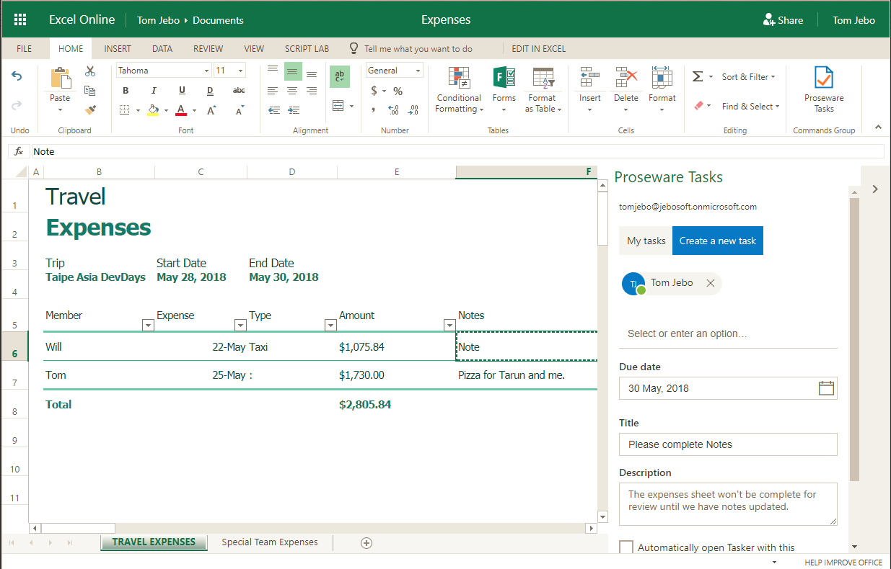

# Taipei DevDays 2018 add-ins-workshop
## Extend the functionality of the Office Apps with Add-ins (Word, Excel, PowerPoint, OneNote) workshop

In this repo there is a sample Office add-in and tutorial modules that guide the user to add Word and Excel specific code to complete the functionality.

## What does the add-in do? 

Proseware Tasker is a collaborative tool for teams that share authoring responsibility for Word, Excel and PowerPoint documents between members of the team or even different teams. 

Tasks can be created and assigned as well as managed in a simple but powerful list format, right inside the document edit session.



## Prerequisites

- Office account tenant for your team.
- Visual Studio (Community is fine)
- git command line tools 
- web browser (Chrome or Edge are fine)

## How do I get started? 

1. Start by cloning this whole repo to your local system.

```
git clone https://github.com/InteropEvents/add-ins-workshop.git
```

2. Next get your tenant and Planner ready for the add-in by following the steps in [the setup document.](setup/setup.md) 

3. At this point, you can open tasker.sln in Visual Studio and build it. 
    - You may need to restore nuget packages. Refer to [Package Restore](https://docs.microsoft.com/en-us/nuget/consume-packages/package-restore) 
    - Set taskerWeb to the default startup project
    - Start without debugging (Ctrl-F5) to run IISExpress hosting the web code.

    TIP: avoid path length issues with packages by cloning the repo low in the file hierarchy like c:\myrepos or something. 

4. Side load this add-in using the tasker/tasker/taskerManifest/tasker.xml. Refer to [Sideload Office Add-ins for testing](https://docs.microsoft.com/en-us/office/dev/add-ins/testing/create-a-network-shared-folder-catalog-for-task-pane-and-content-add-ins) for instructions on sideloading.

5. Now you are ready to follow the tutorial. Start with [Module 1](module1/module1.md). This walks through adding Word specific code to task creation process in Proseware Tasks.

6. Then complete the tutorial by following [Module 2](module2/module2.md). This adds Excel specific code.  