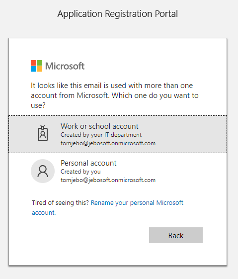

# Setup Instructions for Proseware Tasks Sample

## Register the application to use Graph

1. Sign into the Application Registration Portal  - [https://apps.dev.microsoft.com](https://apps.dev.microsoft.com) - using  your tenant account and select "work or school account" if prompted:

    
    

1. Sign into your tenant (i.e. [user]@[tenant].onmicrosoft.com, [password])

    

1. Click on the **Add an app** button.

1. Enter the name for the app as `Proseware Tasks`, and choose **Create application**.

    

1. The registration page displays, listing the properties of your app.

1. **IMPORTANT:** Copy the *Application Id* and save it to a text file. This is the unique identifier for your app. You'll use the **(*) AppId** value later to configure your app.

    

1. Under **Platforms**, choose **Add Platform**.

    

1. Choose **Web**.

    

1. Make sure the **Allow Implicit Flow** check box is selected, and enter [https://localhost:44382/Home.html](https://localhost:44382/Home.html) as the **Redirect URI**.

1. In **Microsoft Graph Permissions**, next to **Delegated Permissions**, click **Add**.

1. Add the permissions so they match the following screen shot.

       

1. Choose **Save**.

## Get the Planner Task URL from your tenant

1. Use a text editor, such as Notepad, to open `PlannerSetupInfo.txt` in the `/setup` folder of the repo. Then browse to [http://office.com/apps](http://office.com/apps) and sign in to your tenant.

    

1. Open the **Planner** app.

    

1. In the address bar of the browser, copy the full URL. This will be the **(2) tenant-specific base URL** for use later in the code.

## Update the code for your tenant

1. In the `tasker.sln` solution in Visual Studio, go to the top of `taskerCode/taskerWeb/home.js`.

1. There are two variables at the top of `home.js` that look like the code below.

```js
// Per tenant variables to update when building against a new tenant.
// (1) AppId from Application Registration Portal
var azureAppId = "<<add AppId here>>";
// (2) Planner task's tenant-specific base URL. Get this from Planner with an open task.
var plannerTaskUrl = "<<Planner URL goes here>>";

```

1. Using the two numbered items in your text file, update the initialization values for these two variables.

## You are now ready to build the Proseware Tasks sample add-in

**Note:** You may need to restore nuget packages. Refer to [Package Restore](https://docs.microsoft.com/en-us/nuget/consume-packages/package-restore) for information about restoring the nuget packages.

1. In Visual Studio, right click on the `taskerWeb` project name in **Solution Explorer** and select **Set as StartUp Project**.


1. Right click on `taskerWeb` project again and select **Properties**. Then select **Web** | **Start action** | **Specific page** and insert the following: `Home.html`

    

1. Press **Ctrl-F5** to start without debugging. You should see the `Home.html` **Sign in** button.

    

1. Open [Microsoft Word Online](https://www.office.com/launch/word?auth=2) and open a **New blank document**.

1. [Side load the add-in in Word](https://docs.microsoft.com/en-us/office/dev/add-ins/testing/sideload-office-add-ins-for-testing#sideload-an-office-add-in-on-office-online), uploading the `tasker.xml` manifest file in the `taskerCode/tasker/taskerManifest` folder in the project.

    

1. Once you see **Proseware Tasks** in the command bar, open the add-in, sign in, and accept the permissions.

    

    

    