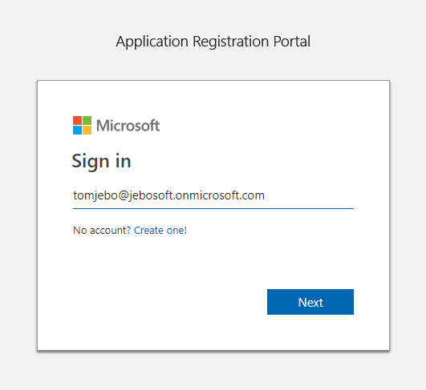
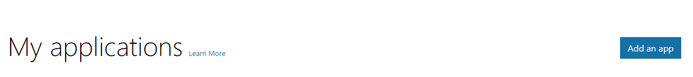
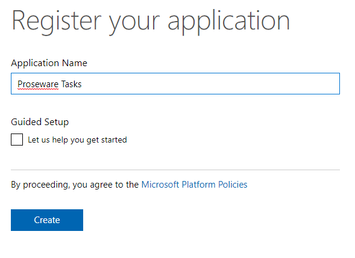
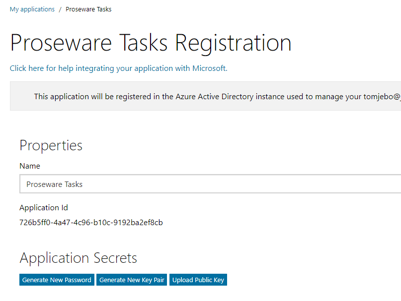
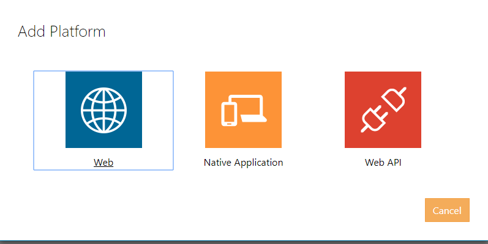

Register the application to use Graph:
1. Sign into the Application Registration Portal  (https://apps.dev.microsoft.com) using "work or school account".

2. Sign into your tenant (i.e. <user>@<tenant>.onmicrosoft.com, <password>)

3. Click on the "Add and app" button.

4. Enter the name for the app as "Proseware Tasks", and choose Create application.

5. The registration page displays, listing the properties of your app.

6. IMPORTANT: Copy the Application Id and save it somewhere. This is the unique identifier for your app. You'll use this value to configure your app.
	

7. Under Platforms, choose Add Platform.
	

8. Choose Web.
	

9. Make sure the Allow Implicit Flow check box is selected, and enter https://localhost:44382/Home.html as the Redirect URI.
10. In Microsoft Graph Permissions, next to Delegated Permissions, click "Add"
	
11. Add the permissions so they match the following: 
	
12. Choose Save.

