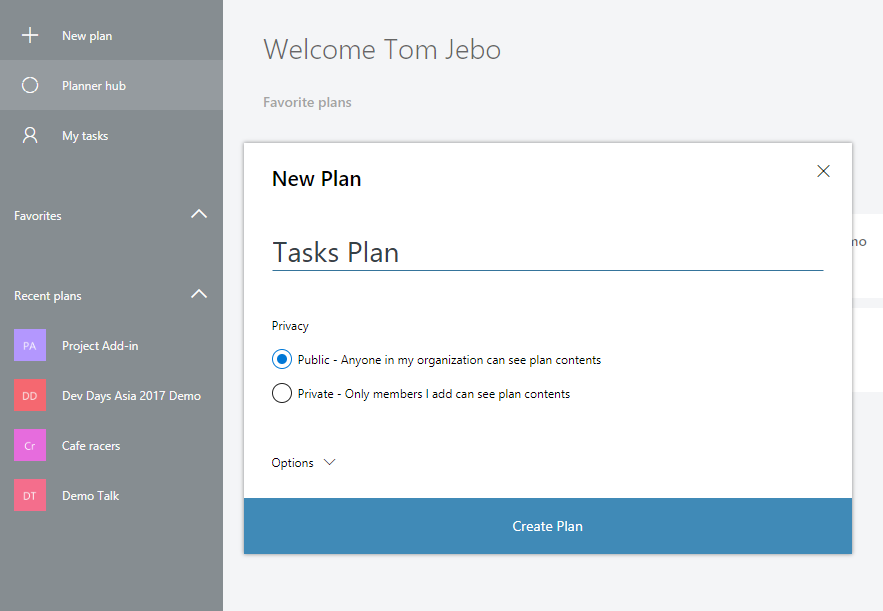
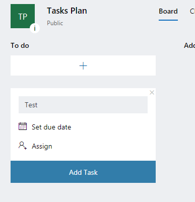
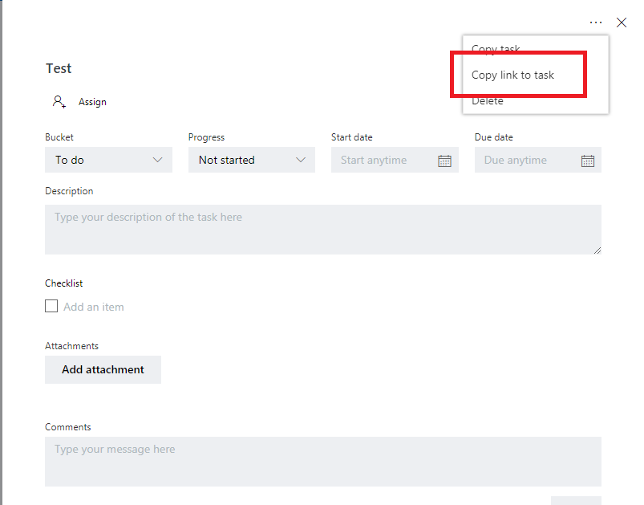
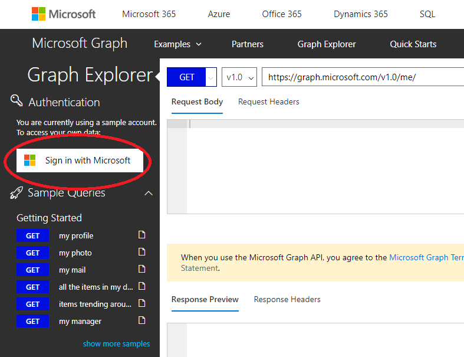
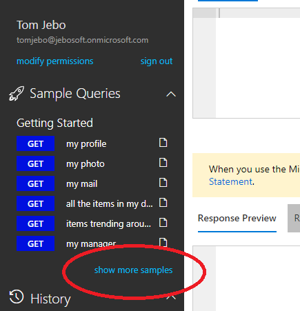
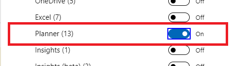
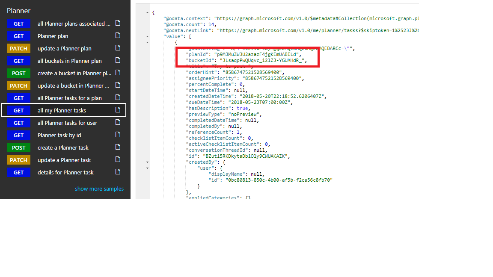

Register the application to use Graph:
1. Sign into the Application Registration Portal  (https://apps.dev.microsoft.com) using "work or school account".

2. Sign into your tenant (i.e. <user>@<tenant>.onmicrosoft.com, <password>)

3. Click on the "Add and app" button.

4. Enter the name for the app as "Proseware Tasks", and choose Create application.

5. The registration page displays, listing the properties of your app.

6. IMPORTANT: Copy the Application Id and save it in Notepad. This is the unique identifier for your app. You'll use this <<(1) AppId value>> to configure your app.
	

7. Under Platforms, choose Add Platform.
	

8. Choose Web.
	

9. Make sure the Allow Implicit Flow check box is selected, and enter https://localhost:44382/Home.html as the Redirect URI.
10. In Microsoft Graph Permissions, next to Delegated Permissions, click "Add"
	
11. Add the permissions so they match the following: 
	
12. Choose Save.

Get the Planner Task URL from your tenant:
1. Log into your tenant

2. Open the Planner app:

3. Click on the "+ New plan" item and create a new <<public>> plan named "Tasks Plan":

4. Create a test task and open it. In the "..." (ellipsis, upper right), click and select "Copy link to task". Paste the URL in Notepad. Save this <<(2) tenant-specific base URL>> for later in the code:

5. Now, in a separate browser tab, open Graph Explorer using https://developer.microsoft.com/en-us/graph/graph-explorer and sign into your tenant with the big <<(3) left>> side button:

6. Click "show more samples" on the bottom left:

7. Select "Planner (..." to get the Planner Graph sample REST API calls:

8. Select the "GET all my Planner tasks" sample from the list and copy the "planId" and "bucketId" with their values from the results pane. Save these <<(4) planId and bucketId>> to Notepad, we will use these to update the code.

Update the code for your tenant:
1. In the tasker.sln solution in Visual Studio, go to the top of taskerWeb/home.js
2. There are four variables at the top of home.js that look like this:

// Per tenant variables to update when building against a new tenant.
// AppId from Application Registration Portal
var azureAppId = "<<appid goes here>>";
// Planner task's tenant-specific base URL. Get this from Planner with an open task.
var plannerTaskUrl = "https://tasks.office.com/jebosoft.onmicrosoft.com/en-US/Home/Task/";
// Bucket ID for the tasks we create.
var bucketId = "3LsaqpPwQUqvc_12lZ3-YGUAHdR_";
// Plan ID for the plan we created.
var planId = "p9MJMuZW3U2azazF4jgKEmUABILd";
 
3. Using the four numbers items in your Notepad file, update the initial values for these four variables.

You are now ready to build the Proseware Tasks sample add-in!

