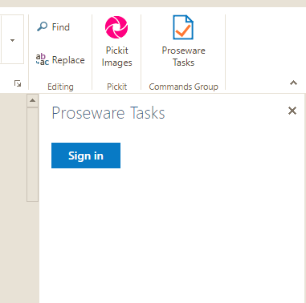

# Setup Instructions for Proseware Tasks Sample

## Register the application to use Graph:

1. Sign into the Application Registration Portal  (https://apps.dev.microsoft.com) using "work or school account".


2. Sign into your tenant (i.e. <user>@<tenant>.onmicrosoft.com, <password>)


3. Click on the "Add an app" button.

4. Enter the name for the app as "Proseware Tasks", and choose Create application.


5. The registration page displays, listing the properties of your app.

6. IMPORTANT: Copy the Application Id and save it in Notepad. This is the unique identifier for your app. You'll use this **(*) AppId** value to configure your app.
	


7. Under Platforms, choose Add Platform.
	


8. Choose Web.
	


9. Make sure the Allow Implicit Flow check box is selected, and enter https://localhost:44382/Home.html as the Redirect URI.
10. In Microsoft Graph Permissions, next to Delegated Permissions, click "Add"
	
11. Add the permissions so they match the following: 
 

	
12. Choose Save.

## Get the Planner Task URL from your tenant:

1. Use Notepad to open `PlannerSetupInfo.txt` in the root of the repo. Then log into your tenant


2. Open the Planner app:


3. In the address bar of the browser, copy the full URL. This will be the **(2) tenant-specific base URL** for use later in the code:

## Update the code for your tenant:

1. In the tasker.sln solution in Visual Studio, go to the top of taskerWeb/home.js
2. There are two variables at the top of home.js that look like this:

```js
// Per tenant variables to update when building against a new tenant.
// (1) AppId from Application Registration Portal
var azureAppId = "<<add AppId here>>";
// (2) Planner task's tenant-specific base URL. Get this from Planner with an open task.
var plannerTaskUrl = "<<Planner URL goes here>>";

``` 

3. Using the two numbered items in your Notepad file, update the initialization values for these two variables.

# You are now ready to build the Proseware Tasks sample add-in!

1. In Visual Studio, right click on "taskerWeb" project name in Solution Explorer and select "**Set as StartUp Project**":


2. Right click on taskerWeb project again and select "**Properties**". Then select Web | Start action | Specific page and insert: Home.html


3. Hit Ctrl-F5 to start without debugging. You should see the Home.html signon button:


4. Side load the add-in in Word, pointing to the tasker.xml manifest in the project:


5. Once you see Proseware Tasks in the command bar, open the add-in and sign in: 





